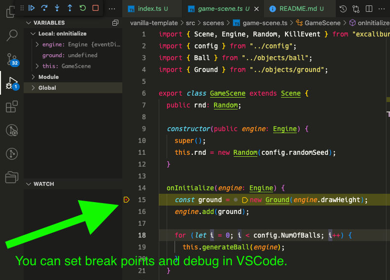
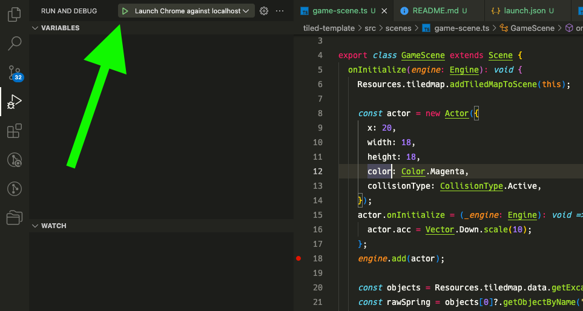

# excalibur-vite-vscode-debuggable-template



This is an Excalibur.js debuggable template for the following environment.

1. Vite
2. VSCode

You can easily debug on VSCode by using this template.

## Requirements💡

1. Node.js

## Get Started🚀

1. Open this repository by VSCode.

2. Open the terminal and execute the following command.

   ```shell
   npm install
   ```

3. Choose the template.

   1. `vanilla-template` : A template for the vanilla Excalibur.js.
   2. `tiled-template` : A template for the Excalibur.js with Tiled Plugin.

4. Edit `.vscode/launch.json` at the following line.

   ```json
     "webRoot": "${workspaceFolder}/vanilla-template/"
   ```

   If you want to use `tiled-template` , change the path.

   (The following description assumes `vanilla-template` .)

5. Open any source code in `vanilla-template/src/` .

   Set the break point by clicking the left point of line numbers.
   Then, you can see the red circle as shown in the top image.

6. Execute following command.

   ```shell
   cd vanilla-template
   npm run dev
   ```

7. Start debug by clicking green button in `Run and Debug` pane.

   

   Then, new chrome window will be opened automatically.

8. When the process reach at break point,
   it will break as expected❗

## Build💪

Execute following command.

```shell
npm run build
```

If there is no error (eg: TypeScript error),
output will be locate `dist` directory.

## Notes🔴

If you want to use Tiled plugin,
all assets used by plugin must be locate in `public` directory.

This is due to Vite limitations.
Vite controll the files by appending hash to filename.
But, Tiled plugin doesn't support hashed filename.

See also [Vite doc](https://vitejs.dev/guide/assets.html#the-public-directory) .

## Credits💎

|             item (description)             |   author    | URL                                                                        |
| :----------------------------------------: | :---------: | :------------------------------------------------------------------------- |
|             graphics for demo              |  kenny.nl   | <https://www.kenney.nl/>                                                   |
|             original template              | excaliburjs | <https://github.com/excaliburjs/template-ts-vite>                          |
|       Parcel2 template (deprecated)        |  tenpaMk2   | <https://github.com/tenpaMk2/excalibur-parcel2-vscode-debuggable-template> |
| Parcel2 Tiled plugin template (deprecated) |  tenpaMk2   | <https://github.com/tenpaMk2/excalibur-tiled-parcel2-template>             |
|       Webpack template (deprecated)        |  tenpaMk2   | <https://github.com/tenpaMk2/excalibur_vscode_debuggable_template/>        |
